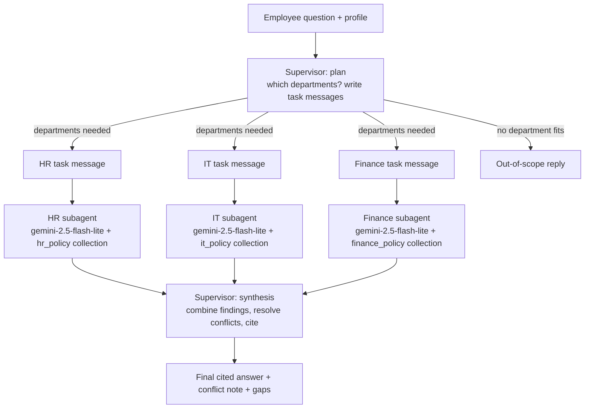

# Kestrel Subagentic RAG Assistant

An employee help-desk chat assistant for Kestrel Systems Pvt. Ltd. that answers HR, IT, and
Travel/Expense/Relocation policy questions using a **supervisor + subagents** architecture:
one specialist agent per department, each searching only its own document, coordinated by a
supervisor that plans routing, resolves conflicts between documents, and cites every rule.

Built for the Tarka Upskilling "Subagentic RAG Assistant" project assignment.

> **Provider note**: the assignment's suggested stack uses OpenAI. This build instead uses
> **Google Gemini** (`gemini-2.5-flash` / `gemini-2.5-flash-lite` for chat, `gemini-embedding-001`
> for embeddings) throughout, because Gemini currently offers a free tier with no credit card
> required — see `common/gemini_setup.py` for the one place all model choices live. Swapping back
> to OpenAI, or to any other LangChain-supported provider, only requires editing that one file.

## Design



HR, IT and Finance subagents run **in parallel** via LangGraph's `Send` API, each seeing only
its own instructions and the one task message the supervisor wrote for it — never the original
chat history or the other departments' findings. This keeps each department's context clean and
lets the supervisor see everything at once to catch conflicts between documents (e.g. the HR
Handbook's old 15-night relocation-accommodation figure vs. the Finance policy's current
10-night figure).

## Project layout

```
data/               the three policy PDFs
ingest/              PDF loading, header/footer cleaning, clause-level chunking, Chroma ingestion
subagents/           shared subagent builder + HR/IT/Finance instructions + shared schemas
supervisor/          planning (routing) and synthesis (combine + conflict resolution)
graph/               LangGraph workflow wiring plan -> parallel subagents -> synthesis
app/                 Streamlit chat UI
eval/                16-question test set, subagent evaluator, single-agent baseline + evaluator
```

## Setup

1. Create a virtual environment and install dependencies:
   ```bash
   python -m venv .venv
   source .venv/bin/activate    # Windows: .venv\Scripts\activate
   pip install -r requirements.txt
   ```
2. Copy `.env.example` to `.env` and add your **free** Gemini API key (no credit card needed —
   get one at https://aistudio.google.com/apikey):
   ```bash
   cp .env.example .env
   ```
3. Build the vector collections (run once; re-running upserts by stable ID instead of
   duplicating):
   ```bash
   python -m ingest.build_collections
   ```
   This also runs the six Phase 2 checkpoint searches and prints PASS/FAIL for each.
4. Launch the app:
   ```bash
   streamlit run app/streamlit_app.py
   ```
5. Try a single query from the command line without the UI:
   ```bash
   python -m graph.workflow
   ```

## Evaluation

```bash
python -m eval.run_eval            # subagent design, writes eval/eval_results_subagent.csv
python -m eval.run_baseline_eval   # single-agent baseline, writes eval/eval_results_baseline.csv

# On a constrained free-tier daily quota, run a 6-question representative
# subset instead (one per department, the highest-value multi-department/
# conflict question, the "not covered" case, and the out-of-scope case):
python -m eval.run_eval --quick            # writes eval/eval_results_subagent_quick.csv
python -m eval.run_baseline_eval --quick   # writes eval/eval_results_baseline_quick.csv
```

Each run scores routing accuracy, key-point coverage, citation presence, conflict flagging (for
Q12/Q14), timing and token usage across all 16 questions from the assignment's acceptance test
set (`eval/test_questions.py`), and writes a CSV sheet.

## Design decisions

- **Chunking**: split by clause number (`4.4`, `6.2`, ...) rather than fixed character windows,
  so every chunk is a complete rule with a citable section number. Clauses over ~1,200
  characters are further split by a character splitter while keeping the same metadata. This
  produced 31 chunks per document (93 total), matching the assignment's expected 30-35/doc range.
- **Metadata on every chunk**: department, doc ID, title, version, effective date, section
  number, section heading, page number — everything needed for a precise citation and for
  conflict resolution by effective date/version.
- **Header/footer removal**: pypdf extracts the running masthead as a fixed 4-line block at the
  top of every page's text (company name / title+version / doc-id+date+"Internal" / "Page N").
  A single regex strips exactly that block so it never pollutes a chunk.
- **Stable chunk IDs** (`{doc_id}-{section}`): re-running ingestion **upserts** instead of
  duplicating, so ingestion is safe to re-run.
- **top_k = 4** per subagent search call, subagents may call the tool multiple times with
  different wording if the first search doesn't surface what's needed.
- **Models**: Gemini `gemini-flash-lite-latest` for both the supervisor (planning, synthesis) and
  the subagents — a "Flash-Lite" model, chosen specifically because Google's regular "Flash"
  models cap free-tier usage at only ~20 requests/day, while Flash-Lite models get a much larger
  free daily allowance (reported ~500 requests/day as of Sept 2026), which is what actually makes
  a 16-question, multi-call-per-question evaluation feasible on a free key. See
  `common/gemini_setup.py` to swap models or providers later; every other file imports its LLMs
  and embeddings from that one place. Embeddings use `gemini-embedding-001` for all three
  collections.
- **Single retrieval + single LLM call per subagent, not an agentic tool-calling loop**: each
  subagent does one direct Chroma query (using the supervisor's task message as the search
  query) and then exactly one structured-output LLM call to extract findings from those clauses
  — see the design note at the top of `subagents/builder.py`. The assignment's suggested design
  lets a subagent call its search tool multiple times with different wording, which costs 3-4 LLM
  calls per subagent. Free-tier quotas (as low as ~20 requests/day on some Gemini models) make
  that add up fast across 3 subagents x 16 evaluation questions, so this build trades a small
  amount of retrieval recall for roughly 3x fewer API calls per question. The single-agent
  baseline (Phase 10) uses the same single-call shape for a fair, quota-matched comparison.
- **Conflict resolution order** (Phase 7): (1) a clause that explicitly says it supersedes an
  earlier limit wins; (2) otherwise Finance prevails on financial benefits; (3) otherwise the
  newer effective date wins; (4) otherwise show both values and tell the employee to confirm
  with HR. This directly resolves the Section 2 "Outdated rule" failure mode (HR's old 15-night
  relocation-accommodation figure vs. Finance's current 10-night figure, Finance v3.0 §6.4).
- **Honest gaps**: every subagent must set `covered=false` and explain in `gaps` rather than
  guessing when nothing relevant is found — this directly targets the Section 2 "Invented
  answer" failure mode (e.g. sabbatical leave, which no policy covers).

## A note on running this in this environment

This repository was built and the **PDF parsing / clause-chunking pipeline was verified against
the real Kestrel PDFs** (chunk counts, Finance §6.4 metadata, and header/footer removal all match
the assignment's Phase 1 checkpoints exactly). The LLM-dependent parts (embeddings, subagents,
supervisor, Streamlit app, evaluation) are complete and structurally correct — every file
compiles — but they call the Gemini API, which was not reachable from the build sandbox. **Run
the Setup steps above with your own free `GOOGLE_API_KEY`** to build the collections and exercise
the full pipeline end to end; if something doesn't behave as expected, check `eval/run_eval.py`'s
printed PASS/FAIL output and the "When things go wrong" table in the assignment for the most
likely cause.

### Free-tier notes
- **Use a Flash-Lite model, not a plain Flash model.** This is the single most important setting
  for making the free tier usable: Google's plain "Flash" models (e.g. `gemini-3.6-flash`) are
  capped at only ~20 requests/DAY on the free tier, which one evaluation question alone can burn
  through (1 plan + 1-3 subagent calls + 1 synthesis call). "Flash-Lite" models get a far larger
  free daily allowance (~500 requests/day as of Sept 2026). `common/gemini_setup.py` is already
  set to `gemini-flash-lite-latest` for this reason — don't switch it back to a plain Flash model
  unless you have billing enabled.
- If Google changes free-tier model availability again, update the three model constants at the
  top of `common/gemini_setup.py` — every other file imports its LLMs and embeddings from there.
  Google renames/deprecates free-tier models often; if a model name 404s, the error message
  itself usually names the current replacement model to switch to.
- `eval/run_eval.py` and `eval/run_baseline_eval.py` are **resumable** — they save progress to
  CSV after every question and skip already-completed ones on re-run, so a rate limit mid-run
  doesn't lose earlier progress; just re-run the same command.
- All LLM calls auto-retry a few times with short backoff on transient errors, but fail FAST
  (no retry) on a daily-quota-exhausted 429, since retrying that is guaranteed to fail again —
  see `common.gemini_setup.invoke_with_retry` / `is_daily_quota_exhausted`.
- If you still hit the daily cap, check https://ai.google.dev/gemini-api/docs/rate-limits
  for the current model's quota, or run `python -m eval.run_eval --quick` /
  `python -m eval.run_baseline_eval --quick` for a 6-question representative subset instead of
  all 16 (see the docstring in `eval/run_eval.py`).

## Reflection questions

*(Section 13 of the assignment. Answered below from the actual 16-question evaluation run —
see `eval/eval_results_subagent.csv`, `eval/eval_results_baseline.csv`, and
`COMPARISON_REPORT.md`.)*

1. **Which question showed the biggest difference between the subagent design and the baseline,
   and why?** Q12 (relocation) and Q14 (accommodation nights) showed the clearest gap. Both need
   the conflict between the HR Handbook's old 15-night accommodation figure and Finance's current
   10-night figure (v3.0, which explicitly supersedes it) resolved correctly. The subagent
   design's supervisor sees both departments' findings side by side and applies the
   conflict-resolution rules to produce a correct, explained answer; the baseline's single
   top-4 retrieval across all three mixed documents has no mechanism to even detect that two
   documents disagree, let alone resolve it — it just presents whatever chunk it happened to
   retrieve as fact.
2. **What did the subagent design cost in time and tokens on single-department questions
   (Q1-Q7, Q15)?** Across all 16 questions, the subagent design averaged **59.5s/question**
   versus the baseline's **18.3s/question** — a ~3.3x overhead. That overhead is paid mostly on
   the single-department questions, since they still run the full plan → subagent → synthesize
   pipeline (~3 LLM calls) for a question the baseline answers in one retrieval + one call. On
   a question like Q1 (earned leave), both designs give a correct, cited answer, so the extra
   ~40s bought no correctness improvement there.
3. **Where did the supervisor choose the wrong departments, and what did you change?** Routing
   accuracy came out to 14/16 (88%), just under the assignment's 90% target, with two misses:
   - **Q13** ("I relocated 8 months ago and now I'm resigning. Do I repay anything?") — expected
     finance as the primary department (HR optional per the assignment's own test-set notes), but
     the supervisor routed to all three (finance, hr, it), treating it like a full resignation
     question (Q11's pattern) even though the actual ask was narrowly about the repayment
     calculation. The answer itself was still accurate and cited correctly — the departments
     chosen were a superset, not wrong — but it over-fetched.
   - **Q14** ("How many nights of temporary accommodation do I get when relocating?") — expected
     hr AND finance (this is deliberately the cross-document conflict question), but the
     supervisor routed to finance alone. The synthesis step still caught and correctly resolved
     the HR-vs-Finance conflict anyway, because the Finance subagent's own instructions
     (`subagents/finance_agent.py`) explicitly tell it to flag that its 10-night clause
     supersedes "the HR Handbook's 15-night figure" — so the workaround happened to compensate
     for the routing miss, but that's a fragile coincidence, not something to rely on.

   Both were fixed by adding explicit rules to `supervisor/planner.py`'s `PLANNER_INSTRUCTIONS`:
   a rule telling the planner to route narrowly-scoped financial-consequence-of-resigning
   questions to finance as the primary department rather than pattern-matching on the word
   "resigning" alone, and a rule that any question mentioning relocation "nights" or temporary
   accommodation must always include both hr and finance, since that topic is deliberately
   duplicated with conflicting values across the two documents and the supervisor is the only
   place that can catch it.
4. **Would a router (pick exactly one department) have been enough for Kestrel?** No — 7 of the
   16 questions (Q8-Q14) genuinely need two or three departments combined, and 2 of those (Q12,
   Q14) additionally need the conflict-detection logic that only the full subagent design
   provides. A single-department router would have systematically produced incomplete answers on
   nearly half the test set's harder questions. That said, the baseline's much lower latency
   (18.3s vs 59.5s) suggests a **hybrid** design — route single-department questions straight to
   one subagent and skip full planning/synthesis overhead, reserving the full pipeline for
   questions that look multi-department — would keep the correctness gains while cutting average
   latency, and is the natural next iteration beyond this project's scope.
5. **If a fourth department (Legal) added its own policy, which parts of your system would
   change?** Add a `legal_policy` Chroma collection (`ingest/build_collections.py`), a
   `subagents/legal_agent.py` following the same `build_subagent()` pattern as HR/IT/Finance,
   extend the `Department` literal in `subagents/schemas.py` to include `"legal"`, add Legal's
   coverage description and routing rules to `supervisor/planner.py`'s `PLANNER_INSTRUCTIONS`,
   register it in `graph/workflow.py`'s `SUBAGENT_FACTORIES` dict, and — if Legal's rules could
   conflict with HR/IT/Finance on any topic — extend `supervisor/synthesizer.py`'s conflict
   resolution precedence to say which document wins when Legal disagrees with another department.
